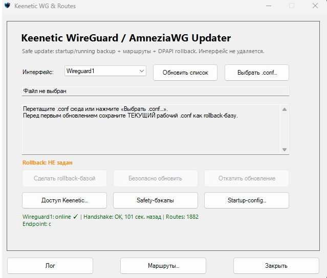

# Keenetic Config Manager

Утилита для безопасного управления **WireGuard / AmneziaWG / AmneziaWG 2.0** и статическими маршрутами на роутерах **Keenetic**.

Программа позволяет обновлять WireGuard-конфигурации с автоматическим резервным копированием и откатом в случае ошибки, а также управлять статическими маршрутами Keenetic через удобный графический интерфейс.

## Скриншот

## Возможности

### WireGuard / AmneziaWG

* поддержка WireGuard;
* поддержка AmneziaWG;
* поддержка AmneziaWG 2.0;
* загрузка `.conf` через кнопку или Drag & Drop;
* выбор существующего WireGuard-интерфейса Keenetic;
* безопасное обновление конфигурации;
* автоматическое создание safety-бэкапа перед изменениями;
* проверка статических маршрутов до и после обновления;
* автоматический rollback при ошибке;
* ручной откат последнего успешного обновления;
* сохранение rollback-базы через Windows DPAPI;
* отображение состояния интерфейса, Endpoint, Handshake и количества маршрутов.

### Статические маршруты

* просмотр маршрутов Keenetic;
* добавление маршрутов;
* удаление выбранных маршрутов;
* поиск и фильтрация;
* массовый импорт из `BAT`, `CMD` и `TXT`;
* экспорт маршрутов в BAT;
* автоматическое резервное копирование конфигурации перед изменениями.

## Требования

* Windows;
* Windows PowerShell 5.1 или новее;
* роутер Keenetic с настроенным WireGuard / AmneziaWG;
* доступ к Keenetic под учётной записью администратора.

## Запуск

Скачайте архив последней версии из раздела **Releases**, распакуйте его в отдельную папку и запустите:

`Start-Keenetic-WG-Updater.vbs`

Обычный запуск выполняется без лишнего окна PowerShell.

Если программа не запускается, используйте:

`Start-Keenetic-WG-Updater-Debug.cmd`

В этом режиме окно PowerShell останется открытым и покажет ошибку.

## Первоначальная настройка

1. Запустите программу.
2. Нажмите **«Доступ Keenetic…»**.
3. Укажите адрес роутера.

Например:

`http://192.168.1.1:8080/`

4. Укажите логин и пароль администратора Keenetic.
5. Нажмите **«Сохранить и проверить»**.
6. После успешного подключения программа автоматически получит список WireGuard-интерфейсов.

Адрес и логин сохраняются для следующих запусков. Пароль хранится средствами **Windows DPAPI**.

## Как обновить WireGuard / AmneziaWG конфиг

### Первый раз

Для безопасного обновления программе сначала нужен текущий рабочий конфиг.

1. Выберите нужный WireGuard-интерфейс, например `Wireguard0`.
2. Нажмите **«Выбрать .conf…»**.
3. Загрузите `.conf`, который соответствует текущей рабочей конфигурации этого интерфейса.
4. Нажмите **«Сделать rollback-базой»**.
5. Убедитесь, что появилось состояние:

`Rollback: готов ✓`

6. Загрузите новый `.conf` через **«Выбрать .conf…»** или перетащите файл в окно программы.
7. Проверьте информацию о загруженном конфиге.
8. Нажмите **«Безопасно обновить»**.
9. Дождитесь завершения операции.

Перед изменением программа автоматически сохраняет текущую конфигурацию Keenetic и маршруты.

Если во время обновления возникает ошибка, программа пытается автоматически вернуть предыдущую рабочую конфигурацию.

### Последующие обновления

После успешного обновления новый конфиг автоматически становится текущей rollback-базой.

Поэтому в следующий раз достаточно:

1. выбрать WireGuard-интерфейс;
2. загрузить новый `.conf`;
3. нажать **«Безопасно обновить»**.

Если конфигурация интерфейса была изменена на Keenetic вручную, программа может потребовать заново сохранить текущий рабочий `.conf` как rollback-базу.

> Безопасное обновление рассчитано на конфиги с одним `[Peer]`.

## Откат обновления

Если необходимо вернуть предыдущую рабочую конфигурацию, выберите нужный интерфейс и нажмите:

**«Откатить обновление»**

Программа использует данные последнего успешного обновления и сохранённую rollback-базу.

## Где хранятся настройки и бэкапы

Рабочие данные программы хранятся отдельно от папки приложения:

`%LOCALAPPDATA%\KeeneticWGUpdater`

В этой папке находятся:

* сохранённые данные доступа к Keenetic;
* адрес роутера;
* журнал работы;
* WireGuard safety-бэкапы;
* rollback-данные;
* резервные копии маршрутов.

Пароль и rollback-конфиги с чувствительными данными защищаются средствами Windows DPAPI.

## Безопасность

Перед изменением WireGuard-конфигурации программа:

1. получает текущий `startup-config`;
2. получает текущий `running-config`;
3. сохраняет список маршрутов;
4. сохраняет rollback-конфигурацию;
5. применяет новый конфиг;
6. повторно проверяет маршруты;
7. только после успешной проверки сохраняет конфигурацию Keenetic.

Если проверка не проходит, сохранение новой конфигурации отменяется и запускается rollback.

## Последняя версия

Актуальную сборку можно скачать в разделе **Releases** этого репозитория.

Текущая версия: **v1.3.4**

## Исходный код

Основная логика приложения находится в:

`Keenetic-WG-Updater.ps1`

Проект написан на PowerShell с использованием Windows Forms.

## Обратная связь

Если нашли ошибку или есть предложение по улучшению — создайте **Issue** в этом репозитории или напишите мне в tg @harlog
