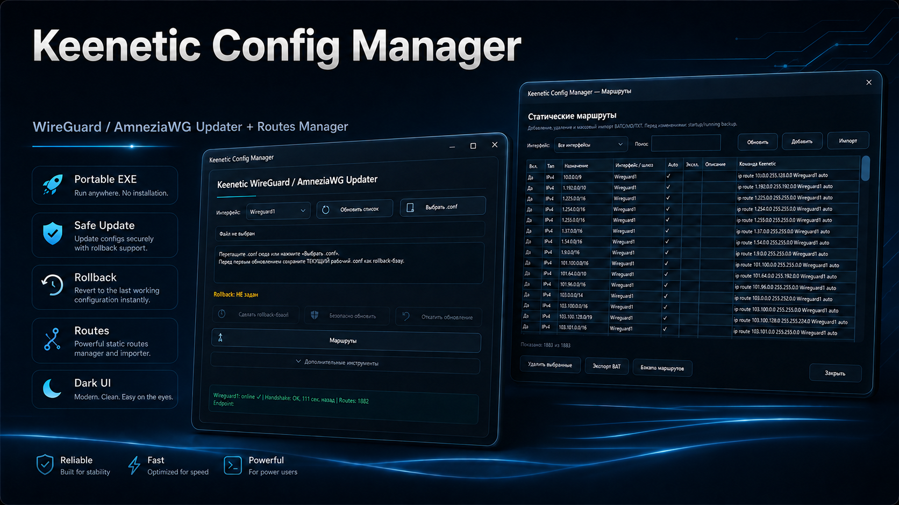

# Keenetic Config Manager

Утилита для безопасного управления WireGuard / AmneziaWG / AmneziaWG 2.0
и статическими маршрутами на роутерах Keenetic.

## Интерфейс

### Главное окно

### Менеджер маршрутов

## Возможности

- WireGuard / AmneziaWG / AmneziaWG 2.0 `.conf` updater.
- Обновление существующего интерфейса без его удаления.
- Startup/running/routes backup перед изменениями.
- DPAPI rollback-база и автоматический rollback.
- Проверка нового peer перед удалением старого.
- Safety-бэкапы и восстановление `startup-config`.
- Просмотр, поиск, добавление и удаление статических маршрутов.
- Массовый импорт BAT / CMD / TXT и IP/CIDR.
- Duplicate Skip и отчёт о количестве повторов.
- Пакетная загрузка больших списков по 950 изменений.
- Асинхронная загрузка маршрутов.
- Фоновый статус WireGuard: online / handshake / routes / endpoint.
- Настраиваемый URL Keenetic и credentials.
- Тёмный WPF-интерфейс.
- Portable single EXE.

## Установка

Установка не требуется. Скачайте последний EXE из **Releases** и запустите его.

> Windows SmartScreen может показать предупреждение «Неизвестный издатель», пока EXE не подписан коммерческим Code Signing сертификатом.

## Первый запуск

1. Откройте **Дополнительные инструменты → Доступ Keenetic**.
2. Укажите адрес роутера, например `http://192.168.1.1:8080/`.
3. Введите логин и пароль администратора Keenetic и нажмите **Сохранить и проверить**.
4. Выберите нужный WireGuard-интерфейс.

## Безопасное обновление `.conf`

Перед самым первым обновлением:

1. загрузите текущий рабочий `.conf`;
2. нажмите **Сделать rollback-базой**;
3. затем загрузите новый `.conf`;
4. нажмите **Безопасно обновить**.

Программа создаёт полный safety-backup, подготавливает новый peer, проверяет его и только после успешной проверки удаляет старый. При ошибке запускается автоматический rollback.

## Статические маршруты

Окно **Маршруты** поддерживает одиночные изменения и массовый импорт.

Поддерживаемые форматы:

- `.bat`
- `.cmd`
- `.txt`
- `route add` / `route delete`
- Keenetic `ip route` / `no ip route`
- IP / CIDR списки

Для больших файлов импорт разбивается на пакеты до 950 изменений. Уже существующие и повторяющиеся ADD-маршруты пропускаются автоматически.

## Данные приложения

Рабочие данные и бэкапы хранятся в `%LOCALAPPDATA%\KeeneticWGUpdater`.

PrivateKey rollback-базы хранится только локально в зашифрованном Windows DPAPI-файле.

## Требования

- Windows 10 / 11 x64
- Windows PowerShell 5.1
- KeeneticOS с доступным локальным интерфейсом управления
